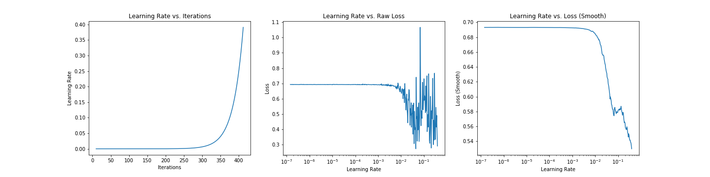

# Keras LR Finder
Plots the change of the loss function of a Keras model when the learning rate is exponentially increasing.

`Works with TensorFlow Keras >=2.0`
>Changes: 
>1. Re-wrote code from scratch with proper usage of tf.keras callback system
>2. Tracks both raw loss and exponentially weighted loss over iterations.
>3. Unification of plots.

## Purpose
See details in ["Estimating an Optimal Learning Rate For a Deep Neural Network"](https://towardsdatascience.com/estimating-optimal-learning-rate-for-a-deep-neural-network-ce32f2556ce0).

## Install
```
pip install git+http://github.com/sbarman-mi9/keras_lr_finder.git
```
## Usage
Create and compile a Keras model, then execute this code:

```python
# model is a Keras model
lr_finder = LRFinder(model)

# Train a model on data of 25k samples, with batch size 32 for 500 steps (batch updates), 
# with learning rate growing exponentially from 1e-7 to 10
lr_finder.find((x_train, y_train), 25000, 32, 1e-7, 10, steps=500)
```

```python
# Plot the iterations, loss, and smoothed loss ignoring 20 batches in the beginning and 5 in the end
lr_finder.plot(skip_start=20, skip_end=5)
```



## Contributions
Contributions are welcome. Please, file issues and submit pull requests on GitHub, or contact me directly.

## References
This code is based on:
- The method described in section 3.3 of the 2015 paper ["Cyclical Learning Rates for Training Neural Networks"](https://arxiv.org/abs/1506.01186) by Leslie N. Smith
- The implementation of the algorithm in [fastai library](https://github.com/fastai/fastai) by Jeremy Howard. See [fast.ai deep learning course](http://course.fast.ai/) for details.
- Blog post: https://sgugger.github.io/how-do-you-find-a-good-learning-rate.html
- https://towardsdatascience.com/estimating-optimal-learning-rate-for-a-deep-neural-network-ce32f2556ce0
- Blog post: jeremyjordan.me/nn-learning-rate
- https://www.pyimagesearch.com/2019/08/05/keras-learning-rate-finder/

